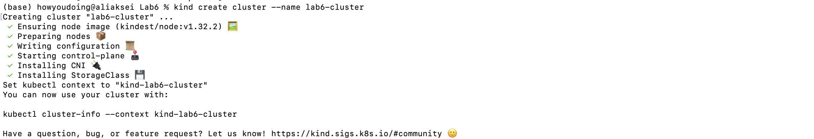
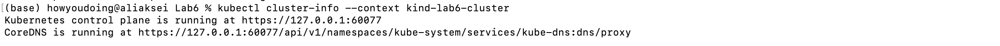
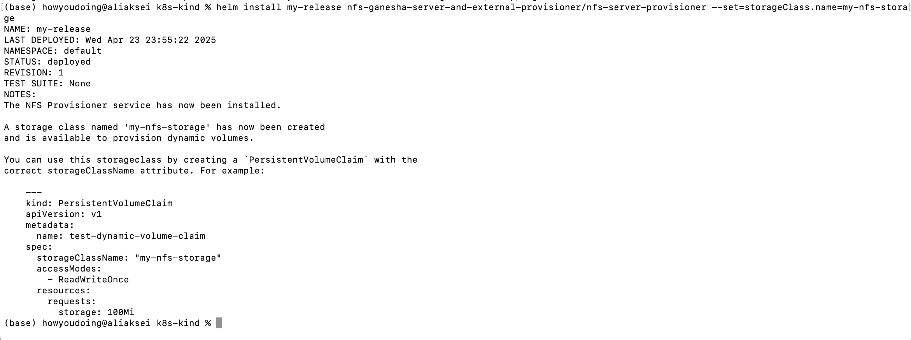
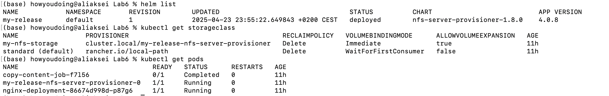
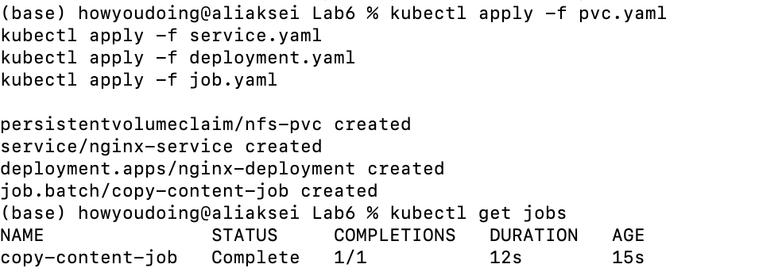
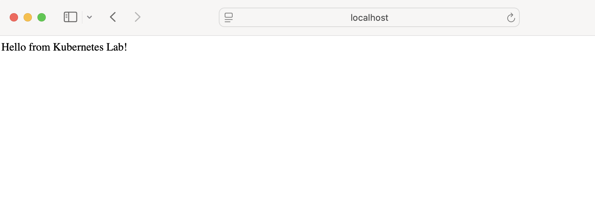

## 1: Create a Kubernetes Cluster (using kind)
**kind** stands for **Kubernetes IN Docker** — a tool that lets you run a local Kubernetes cluster using Docker containers.

```bash
# Installing kind and kubelctl
brew install kind
brew install kubectl

# Creating a kind cluster
kind create cluster --name lab6-cluster
```


After let's verify the cluster is running.
```bash
# Verifing cluster
kubectl cluster-info --context kind-lab6-cluster
```



## 2. Install an NFS Server Provisioner via Helm

Let's set up dynamic storage provisioning in our cluster using an NFS (Network File System) server. Kubernetes needs persistent volumes, and NFS can provide shared storage.

With *repo add* we add a Helm repo that contains charts to deploy an NFS server and provisioner, after using *install* we are creating a StorageClass named my-nfs-storage to allow dynamic PVC provisioning.

```bash
# Fetching and installing repo
helm repo add nfs-ganesha-server-and-external-provisioner https://kubernetes-sigs.github.io/nfs-ganesha-server-and-external-provisioner/

helm install my-release nfs-ganesha-server-and-external-provisioner/nfs-server-provisioner --set=storageClass.name=my-nfs-storage
```


## 3. Verify Storage & Pods
- **helm list**: Shows Helm releases (i.e., what's installed).
- **kubectl get storageclass**: Confirms the my-nfs-storage StorageClass exists.
- **kubectl get pods**: Verifies the NFS server pod is running.
```bash
# Verifying releases, storage and server pod
helm list
kubectl get storageclass
kubectl get pods
```


##  4: Apply Kubernetes Resources

```bash
# Applying yaml configurations
kubectl apply -f pvc.yaml
kubectl apply -f service.yaml
kubectl apply -f deployment.yaml
kubectl apply -f job.yaml

kubectl get jobs
```


## 5. See the results
```bash
kubectl port-forward svc/nginx-service 8080:80
```


## 6. Diagram
```bash
+----------------------+       +-----------------------+  
|   NFS Provisioner    |       |   StorageClass        |  
| (Creates PVs via     |<------| (my-nfs-storage)      |  
|  Helm installation)  |       +-----------------------+  
+----------------------+               ▲  
           |                          │  
           | Provisions               │ References  
           v                          │  
+----------------------+       +-----------------------+  
| PersistentVolume (PV)|<------| PersistentVolumeClaim |  
| (Auto-created)       |       | (nfs-pvc)             |  
+----------------------+       +-----------------------+  
                                 ▲               ▲  
                                 │               │  
          +----------------------+               +----------------------+  
          │ Mounts at /mnt                       │ Mounts at             
          │                                      │ /usr/share/nginx/html  
          v                                      v  
+----------------------+              +----------------------+  
|       Job Pod        |              |    Deployment Pod    |  
| (copy-content-job)   |              | (nginx-deployment)   |  
| Writes index.html    |              | Serves index.html    |  
+----------------------+              +----------------------+  
                                                 ▲  
                                                 │  
                                      +----------------------+  
                                      | Service              |  
                                      | (nginx-service)      |  
                                      +----------------------+  
                                                 ▲  
                                                 │  
                                      +----------------------+  
                                      | Port-Forward         |  
                                      | (localhost:8080 → 80)|  
                                      +----------------------+  
```